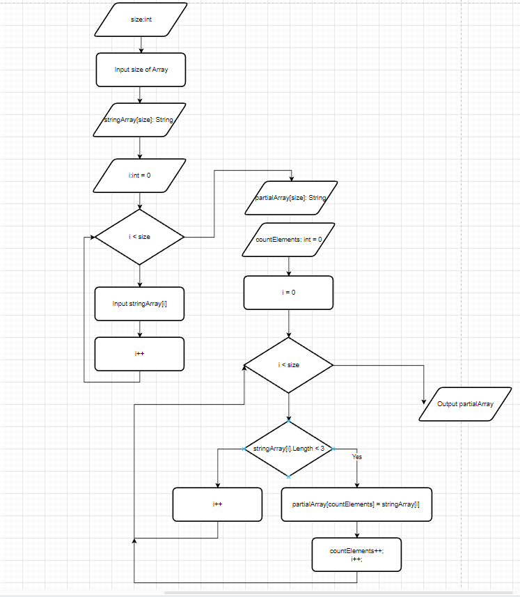

# Контрольная работа
## Задание:
*Написать программу, которая из имеющегося массива строк формирует новый массив из строк, длина которых меньше, либо равна 3 символам. Первоначальный массив можно ввести с клавиатуры, либо задать на старте выполнения алгоритма. При решении не рекомендуется пользоваться коллекциями, лучше обойтись исключительно массивами.*

## Объявленные тесты:
* [“Hello”, “2”, “world”, “:-)”] → [“2”, “:-)”]
* [“1234”, “1567”, “-2”, “computer science”] → [“-2”]
* [“Russia”, “Denmark”, “Kazan”] → []

## Решение
Блок схема алгоритма доступна по ссылке [Блок схема](https://disk.yandex.ee/d/J6oD8EBldzGXUw). Навсякий случай прикладываю фотографию в случае недоступности ссылки: 

### Написанные функции
1. CreateStringArray - Функция для создания массива, которая принимает на вход массив и заполняет его с помощью польовательского ввода с консоли
2. PrintStringArray - Функция для вывода массива, которая приниает на вход массив и некий параметр isNotNullElements, который опционально позволяет распечатать массив без нулевых элементов (чтобы удовлеворить формат вывода из задания выше)
3. CreateArrayWithElementsOf3letters - Главная функция программы, которая создаёт и заполняет по условию новый массив, состоящий из элементов, которые меньше или равны 3 буквам.

Верхнеуровнево можно выделить следущие шаги программы
* Вводится размер массива (через пользовательский ввод)
* Объявляется и заполняется массив с помощью функции CreateStringArray
* Объявляется новый массив и заполняется с помощью функции CreateArrayWithElementsOf3letters
* Формируется итоговый вывод в формате {Изначальный массив полностью} -> {Полученный массив, исключая нулевые элементы}